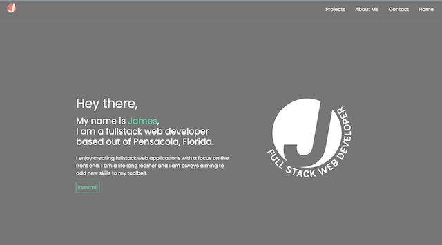
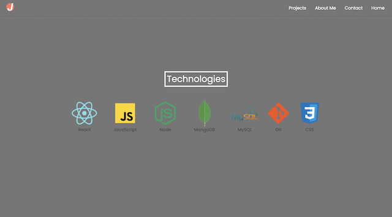
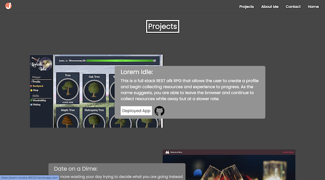
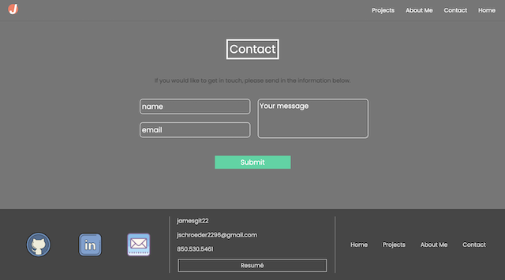
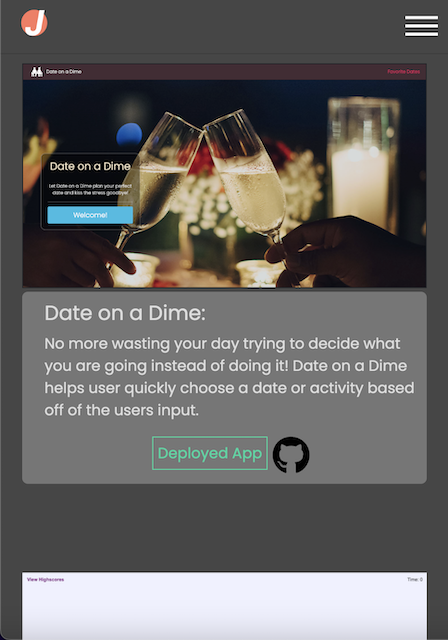

# React Portfolio

  

  ## [Live Site]()

  ## Description:
        
  Welcome to my developer portfolio created using react!
    
  ---
  
  ## Table of Contents:
    
  - [Instillation](#instillation)
  - [Usage](#usage)
  - [Credits](#credits)
  - [License](#license)
  - [Questions](#questions)
  
  ## Instillation:
  
  You can view the live site [here](), or clone the repository from [github](https://github.com/Jamesgit22/React-Portfolio) to run from your local text editor.
  
  ## Usage:
  
  This portolio is designed to showcase my current abilities as a developer and will be periodically updated.
  
  ---

  ## ScreenShots:

  

  

  

  

  

  ---

  ## Credits:
  
  Third-party Assets:

  - [Vite](https://vitejs.dev/)
  - [Framer Motion](https://www.framer.com/motion/)
  - [React](https://react.dev/)
  - [Bootstrap](https://getbootstrap.com/)

  Icons:
  - [Font Awsome](https://fontawesome.com/icons)
  - [Icons8](https://icons8.com/)

  Tutorials:
  - [Responsive Navigation Bar with mobile menu Using HTML & CSS](https://www.youtube.com/watch?v=OjQP7rPwJyE)
  - [How to create a Mobile Menu in React](https://www.youtube.com/watch?v=smhpMQQmNRI&t=210s)
  

  
  
  
  
  ## License:
  
  This project uses the [MIT](https://opensource.org/licenses/MIT) license.

  ## Tests:

  ---
  
  ## Questions:

  Please feel free to get in contact if you have any questions about this project.

  - Github: [Jamesgit22](https://github.com/Jamesgit22)
  - Email: jschroeder2296@gmail.com